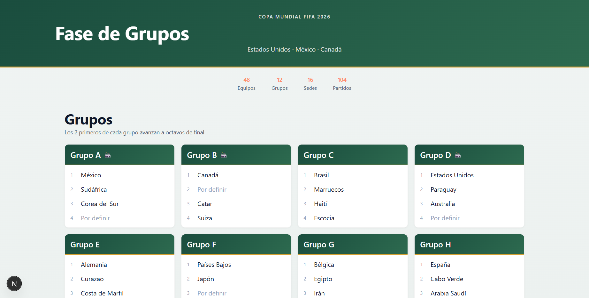
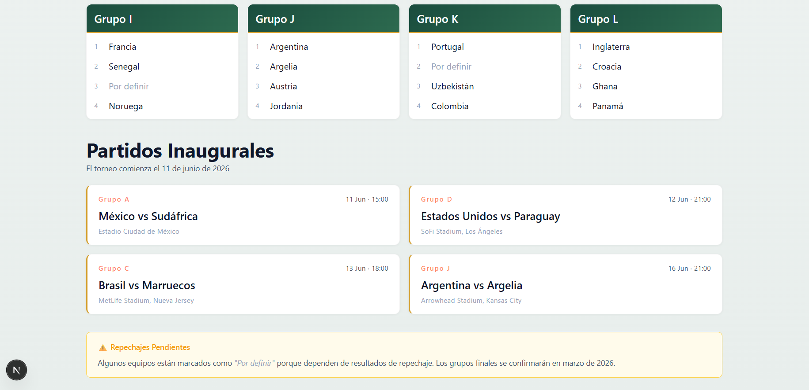
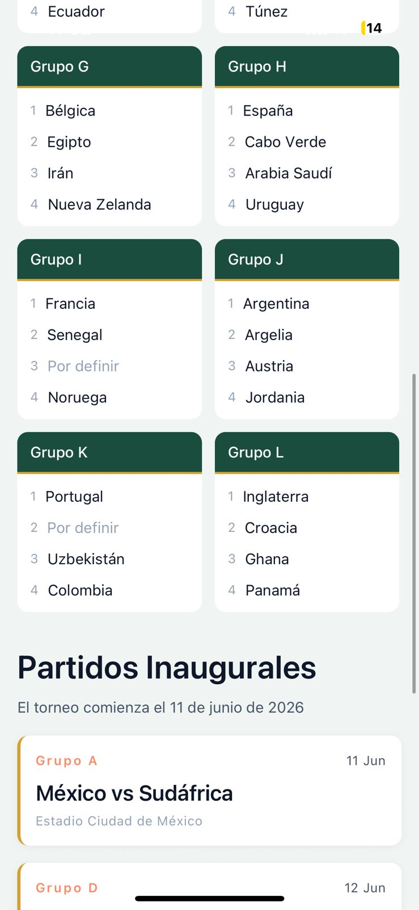
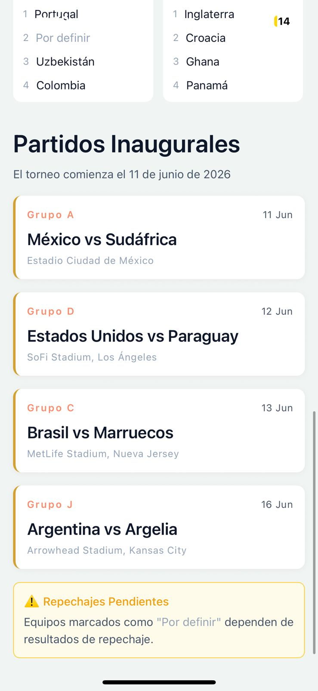

# Design-System-exercise

> Foundational Design System package para la postulación de Matías Soto a Fintual.

---

## Como ejecutar Design System y sus dependencias

### Requisitos Generales

- **Node.js**: versión 18.0.0 o superior

- **npm**: versión 8.0.0 o superior (viene con Node.js)

- **Ejemplo Native/Expo**:
  - App Expo Go instalada en algún dispositivo Android o iOS (SKD 54)
  - **Alternativamente**, puedes usar emuladores de iOS en macOS o Android Studio en Windows

### Ejecución

#### Design System

```bash
# Clonar el repositorio
git clone https://github.com/Seld0nn/design-system-exercise.git
cd design-system-exercise

# Instalar dependencias
npm install

# Buildear el design system
npm run build --workspace=packages/design-system
```

#### **Ejemplo Web (Next.js)**

```bash
# Correr web
npm run dev:web      # Web example
```

Abre http://localhost:3000

### **Ejemplo React Native (Expo Go)**

```bash
npm run dev:native   # Native example
```

Escanea el QR con Expo Go app.

---

## Uso design system

Está preparado para ser publicado como npm package.

#### **Instalación:**

```bash
npm install design-system
# o
yarn add design-system
```

#### **Uso en React (Web):**

```tsx
import { ThemeProvider, Text, Heading } from "design-system";

function App() {
  return (
    <ThemeProvider initialMode="light">
      <div>
        <Heading level={1}>Bienvenido</Heading>
        <Text variant="body" color="secondary">
          Este es un ejemplo del design system
        </Text>
      </div>
    </ThemeProvider>
  );
}
```

#### **Uso en React Native:**

```tsx
import { ThemeProvider, Text, Heading } from "design-system";
import { View } from "react-native";

function App() {
  return (
    <ThemeProvider initialMode="light">
      <View>
        <Heading level={1}>Bienvenido</Heading>
        <Text variant="body" color="secondary">
          Este es un ejemplo del design system
        </Text>
      </View>
    </ThemeProvider>
  );
}
```

**Nota 1:** El mismo código de importación funciona en ambas plataformas. Los bundlers (Metro/Webpack) resuelven automáticamente la versión correcta.

**Nota 2:** Configuración adicional para Next.js (requerido)

```javascript
// next.config.js
module.exports = {
  transpilePackages: ["design-system"],
};
```

---

## **Componentes Disponibles**

**1. ThemeProvider**

Wrapper principal que proporciona el theme a todos los componentes.

```tsx
<ThemeProvider
  initialMode="light"
  onThemeChange={(mode) => console.log("Theme changed to:", mode)}
>
  <App />
</ThemeProvider>
```

**2. Text Component**

Componente de texto flexible con múltiples variantes.

```tsx
<Text variant="body" color="primary">Texto normal</Text>
<Text variant="caption" color="secondary">Texto pequeño</Text>
<Text variant="label" weight="bold">Etiqueta en negrita</Text>
<Text variant="code" italic>Código en cursiva</Text>
```

**Variants disponibles:**

- `body`, `bodyLarge`, `bodySmall` - Texto general
- `caption` - Texto pequeño (metadata, hints)
- `label` - Etiquetas y badges
- `overline` - Texto uppercase con letter-spacing
- `code` - Código inline

**Props:**

- `variant?: TextVariant` - Estilo del texto
- `color?: TextColor` - Color del texto
- `align?: 'left' | 'center' | 'right' | 'justify'`
- `weight?: FontWeight` - Peso de la fuente
- `size?: number` - Override del fontSize
- `italic?: boolean` - Cursiva
- `underline?: boolean` - Subrayado
- `numberOfLines?: number` - Limitar líneas con ellipsis

---

**3. Heading Component**

Componente para títulos con jerarquía semántica.

```tsx
<Heading level={1}>Título Principal</Heading>
<Heading level={2} color="accent">Subtítulo</Heading>
<Heading level={3} weight="medium">Sección</Heading>
```

**Props:**

- `level: 1 | 2 | 3 | 4 | 5 | 6` - Nivel del heading
- `color?: HeadingColor` - Color del heading
- `align?: 'left' | 'center' | 'right'`
- `weight?: FontWeight` - Peso de la fuente
- `as?: 'h1' | 'h2' | ... ` - Override de elemento HTML (web only)

**4. useTheme Hook**

Hook para acceder al theme en componentes personalizados.

```tsx
import { useTheme } from "design-system";

function CustomComponent() {
  const { theme, toggleTheme } = useTheme();

  return (
    <button onClick={toggleTheme} style={{ color: theme.active.text.primary }}>
      Cambiar tema
    </button>
  );
}
```

**5. Design Tokens**

Los tokens también están exportados para uso directo:

```tsx
import { colors, typography } from "design-system";

// Acceder a colores
const primaryColor = colors.primary[400];
const textColor = colors.theme.light.text.primary;

// Acceder a tipografía
const headingStyle = typography.textStyles.h1;
const baseSize = typography.fontSize.base;
```

---

## Decisiones Técnicas

1. Usar extensiones `.native.tsx` para resolución automática de plataforma. (Un solo import, funciona en ambas plataformas)

```typescript
// El mismo código funciona en ambas plataformas
import { Text, Heading } from "design-system";
```

2. Usar valores numéricos sin unidades para fontSize y spacing. ( Los números funcionan en CSS y React Native)

```typescript
// tokens/typography.ts
export const typography = {
  fontSize: {
    base: 16, // No "16px" - funciona en ambas plataformas
    lg: 18,
    xl: 20,
  },
  fontWeight: {
    normal: "400", // String para compatibilidad con React Native
    bold: "700",
  },
};
```

3. Usar `theme.active.*` para evitar condicionales en componentes.

```typescript
const color = theme.active.text.primary;
```

- Preparado para el futuro: Agregar dark mode es trivial.

- Similar a Material-UI y otros design systems

```typescript
// theme/ThemeContext.ts
export const getActiveColors = (mode: ThemeMode) => ({
  text: {
    primary: colors.theme[mode].text.primary,
    secondary: colors.theme[mode].text.secondary,
    // ...
  },
  // Colores adaptados según el modo
});
```

4. Usar `tsup` para generar múltiples formatos. (permite optimización de bundle)

```json
{
  "main": "./dist/index.js", // CommonJS
  "module": "./dist/index.mjs", // ES Modules
  "types": "./dist/index.d.ts", // TypeScript
  "react-native": "./dist/index.js"
}
```

5.  Estructura de monorepo simple sin herramientas adicionales. (menos es más)

```
design-system-exercise/
├── packages/
│   └── design-system/              # Design System package
│       ├── src/
│       │   ├── components/
│       │   │   ├── Text/
│       │   │   │   ├── Text.tsx           # Implementación Web
│       │   │   │   ├── Text.native.tsx    # Implementación Native
│       │   │   │   ├── types.ts           # Types compartidos
│       │   │   │   └── index.ts
│       │   │   └── Heading/
│       │   │       ├── Heading.tsx
│       │   │       ├── Heading.native.tsx
│       │   │       ├── types.ts
│       │   │       └── index.ts
│       │   ├── theme/
│       │   │   ├── ThemeContext.ts        # Context definition
│       │   │   ├── ThemeProvider.tsx      # Provider component
│       │   │   └── useTheme.ts            # Hook
│       │   ├── tokens/
│       │   │   ├── colors.ts              # Color palette
│       │   │   └── typography.ts          # Typography scale
│       │   ├── utils/
│       │   │   └── getColorValue.ts       # Color utilities
│       │   └── index.ts                   # Public API
│       ├── dist/                          # Built files
│       ├── package.json
│       ├── tsconfig.json
│       └── tsup.config.ts
│
├── examples/
│   ├── web/                        # Next.js Example
│   │   ├── app/
│   │   │   ├── layout.tsx
│   │   │   ├── page.tsx           # Mundial 2026 demo
│   │   │   └── globals.css
│   │   ├── package.json
│   │   └── next.config.js
│   │
│   └── native/                     # Expo Example
│       ├── App.tsx                # Mundial 2026 demo
│       ├── package.json
│       ├── metro.config.js        # Monorepo config
│       └── app.json
│
├── llm-conversations/             # Conversaciones con IA
│   ├── planning.md               # Planning inicial
│   └── codereviewer.md           # Code reviews
│   └── readme.md                 # Readme helper
│
├── package.json                  # Workspace root
└── README.md                     # Este archivo
```

---

## Uso de IA

Este proyecto fue desarrollado con asistencia IA, cumpliendo con la transparencia requerida en el enunciado.

### **Herramientas utilizadas:**

#### **1. Proceso de desarrollo asistido:**

El flujo de trabajo fue:

1. **Planning** → Discusión con IA sobre arquitectura
2. **Implementación** → Cursor Tab se utilizó como apoyo en el desarrollo. Por ejemplo, la mayoría de los comentarios del código y detalles en los estilos de design-system fueron sugeridos por Cursor Tab.
3. **Review** → IA revisaba el código con feedback específico
4. **Iteración** → Ajustes basados en sugerencias

Todas las conversaciones están documentadas en:

- `llm-conversations/planning.md` - Planning inicial y arquitectura
- `llm-conversations/codereviewer.md` - Reviews paso a paso
- `llm-conversations/readme.md` - Asistencia para creación del readme

---

## Demo Visual

### Web (Next.js)

<div align="center">
  
</div>

<div align="center">
  
</div>

### Mobile (React Native - iOS)

<div align="center">
  
  
  
  <p><i>Mismos componentes funcionando nativamente en iOS y Android con Expo Go</i></p>
</div>
